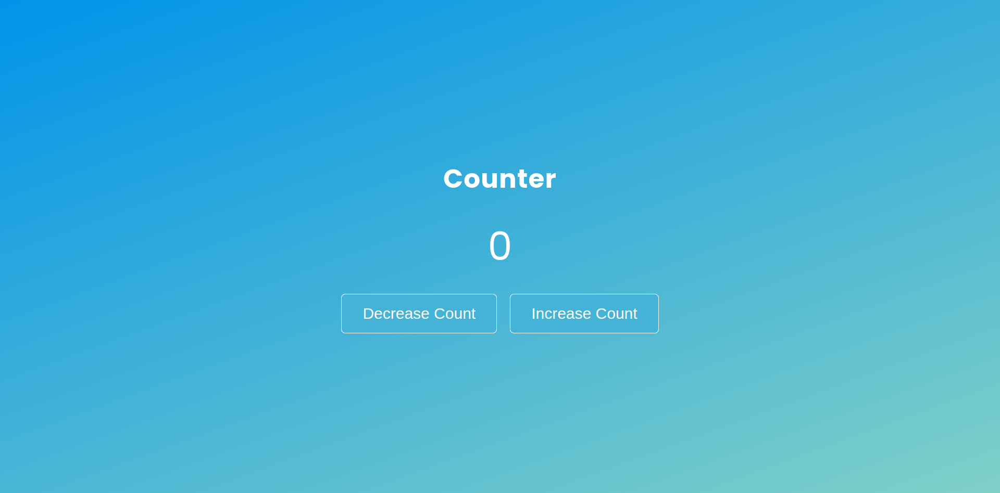

<h1 align="center">Vue Counter App</h1>

## Table of Contents

- [Overview](#overview)
  - [Built With](#built-with)
- [How to use](#how-to-use)
- [Acknowledgements](#acknowledgements)
- [Credit](#credit)
- [Contact](#contact)

## Overview




### Built With

- [Vue Template Syntex](#built-with)
- [Vue setup with Vite](#built-with)
- [Vue methods](#built-with)

## How To Use

To clone and run this application, you'll need [Git](https://git-scm.com) installed on your computer. From your command line:
## Clone this repository
```bash
git clone https://github.com/saadman-galib/JS-Project-Counter.git
```


## Acknowledgements

- [](#acknowledgements)

## Credit
The background color I have used is from [CSS Gradient](https://cssgradient.io/)

## Contact

- GitHub [@saadman-galib](https://www.github.com/saadman-galib)
- Twitter [@GalibSaadman](https://www.twitter.com/GalibSaadman)
- Facebok Page [@Saadman Codes](https://www.facebook.com/saadman.codes/)